 현재 진행형으로 계속 삽질중..

centos에 Caffe 설치 삽질...
>그래픽 카드 드라이브 설치.
>cuda 설치.
>python용 pycuda 설치....
>여기까지 3일 걸림...
>Caffe 라이버러리 설치.
>여기까지 또 하루 추가.

caffe 사용법 몰라서 해맴....
>    이게 뭐지.. API 레퍼런스, 사용법 사이트 막 뒤적이면서
    하나 하나 찾아가보다다....
    모르곘다... T_T

서교수님의  Deep Learning 세미나에서 caffe 사용법을 배움.
>발표 자료를 하나 하나 따라해 가면서... 
>대충 학습 방법을 배움...
>이걸 어디다 쓸까 고민 고민..
>취미 생활에 적용해보자 (^^) 

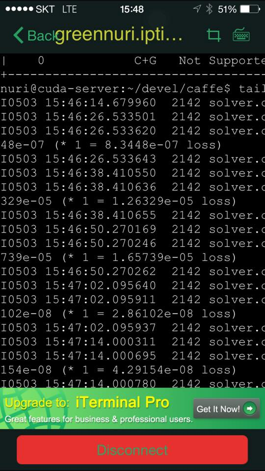
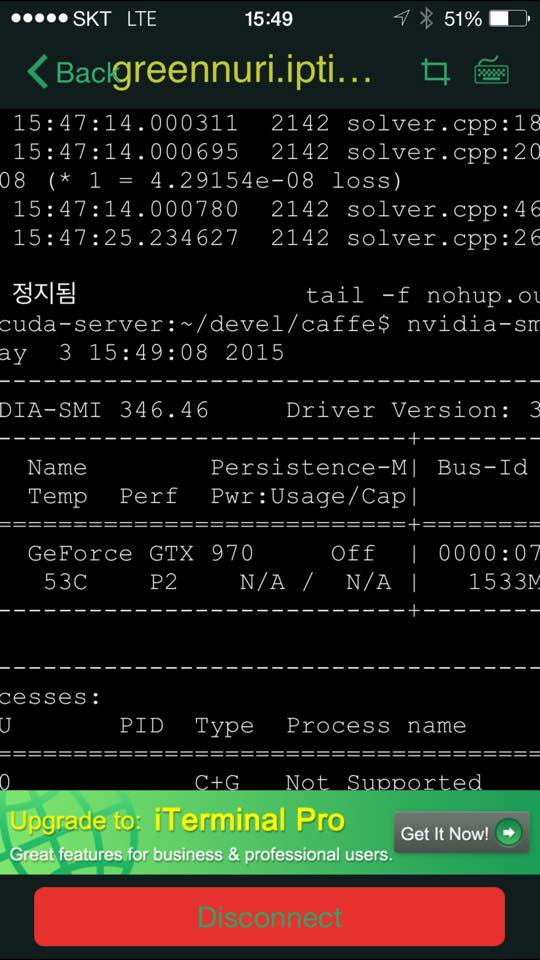
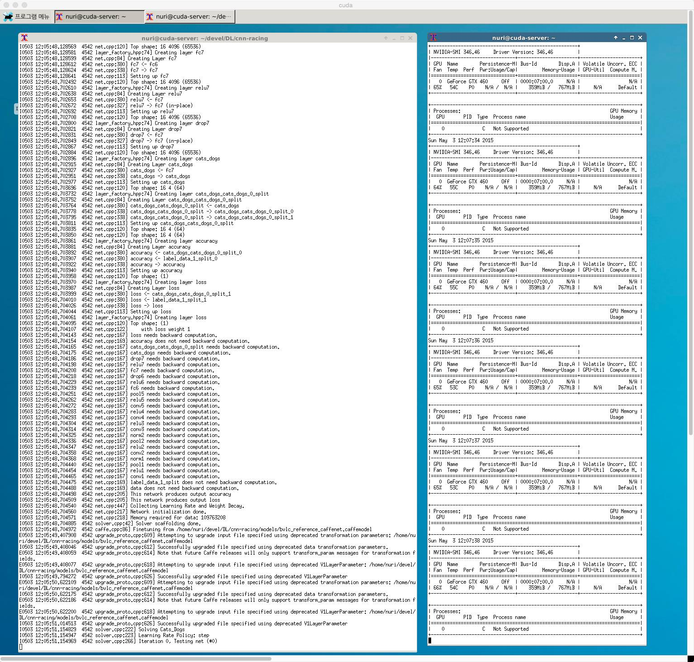
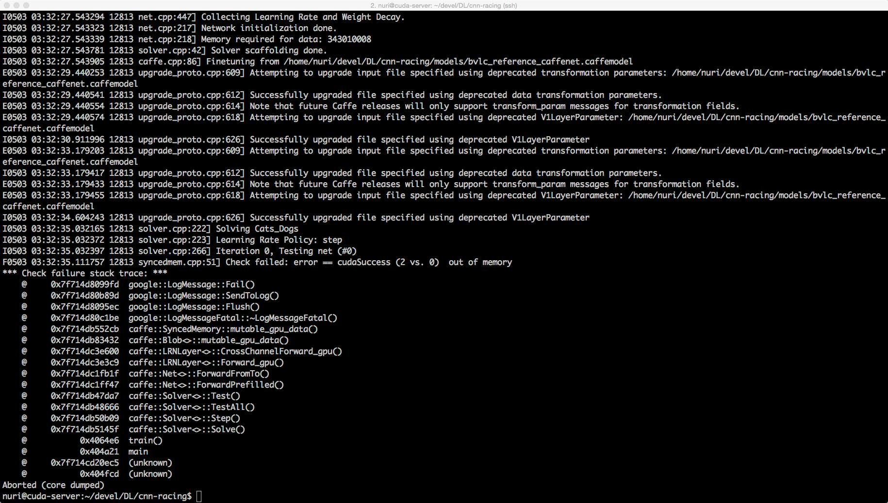
gtx 460 메로리 넘 딸림..

우연히 NVIDIA DIGITS 패키지 발견.
>네이버에서 한 Deep Learnign  세미나에서 NVIDIA사에서 나온 직원이 발표.
>엇 이건.. caffe에 web UI... 
>똑같은 Caffe인데 UI가 더 쉽다면
>이걸로... 

데이타 수집
>기존의 사진중에서 인물들만 골라서 하려고 했는데....
>DIGITS에서 돌릴려니 jpg이미지 필요...
>RAW 파일을 가지고 있어서 변환 작업이 귀찮아서,
>페이스북에서 몇명 찍어서 그 사람들 앨범을 그냥 일일이 수작업으로 저장해서 
>싹 저장하고 학습 모델에 적용..

DIGITS 학습
>DIGITS에서 수집된 사진들을 데이타 소스로 넣고 
>모델을 바꿔 가면서, 모델마다 옵션을 하나 하나 바꿔 가면서 테스트.
>AlexNet모다 Google LeNet이 성능이 좋음.
>구글 LeNet이 더 복잡하니 당연한건지도..
>그럼에도 불구하고 Top5  정확도가 70%넘기가 힘듬...
>Deep Conv Learning이면 90%는 기본아닌가?...

>클래스 하나당(한 사람당) 데이타(사진)이 작은 케이스가 정확도를 해치나 싶어서
>한 클래스당 데이타가 200이상인 클래스만 따로 모아서 학습 시킴.
>결과는... 똑같음...

>얼굴만 입력해야 하는데 통째로 사진을 다 집어 넣어서 그런가?...
>다른 방법이 뭐가 있나 고민 고민.... 

>여기 까지가 2015년 6~7월 사이... 
>그동안 병원 입원 2회, 수술 1회.

휴식~
>2015년 9월 초순까지 그냥 손 놓고 있으면서 다른 방법이 뭐나 있나 
>여기 저기 기웃 기웃... 

여기까지의 결과 
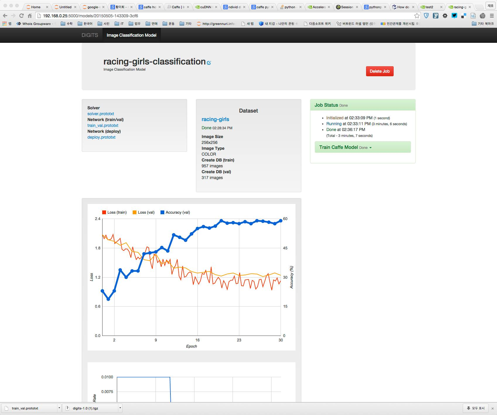
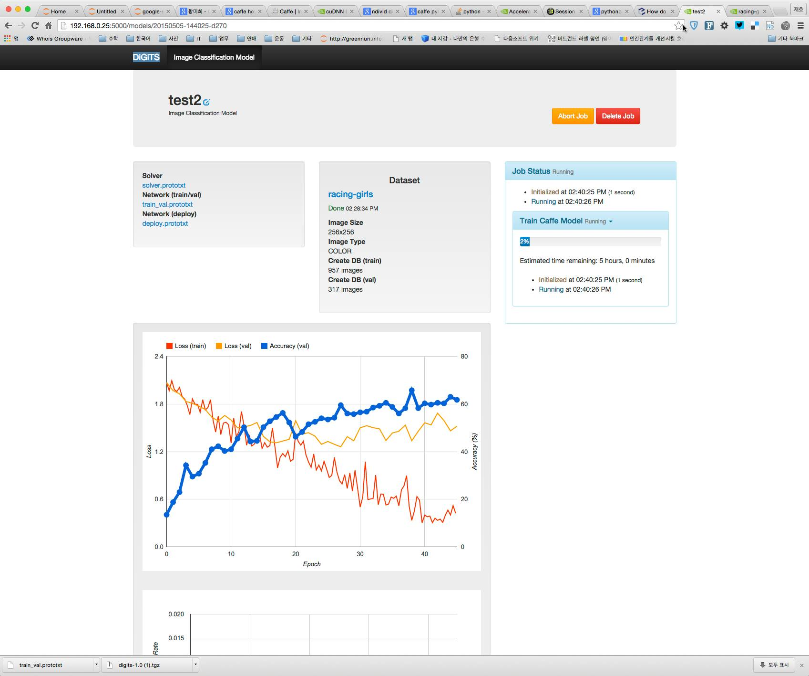
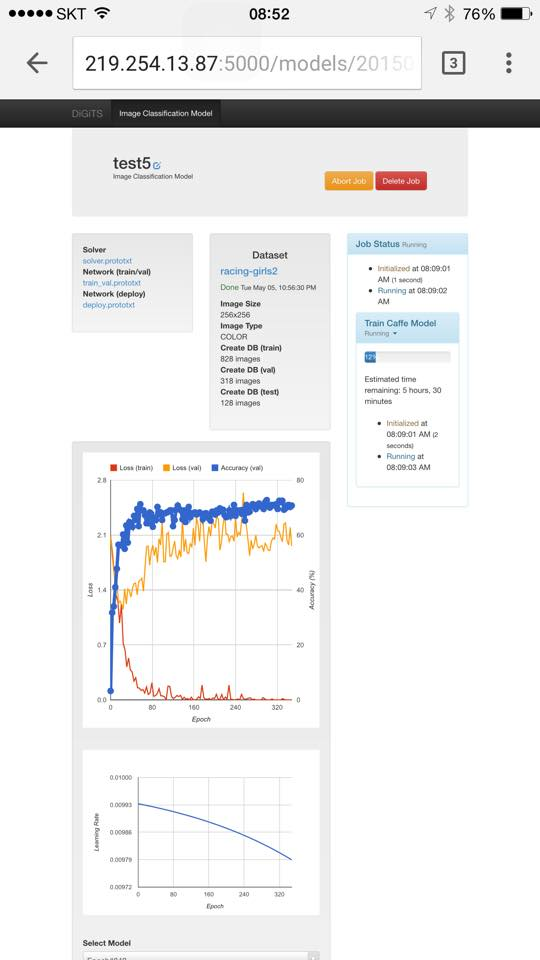
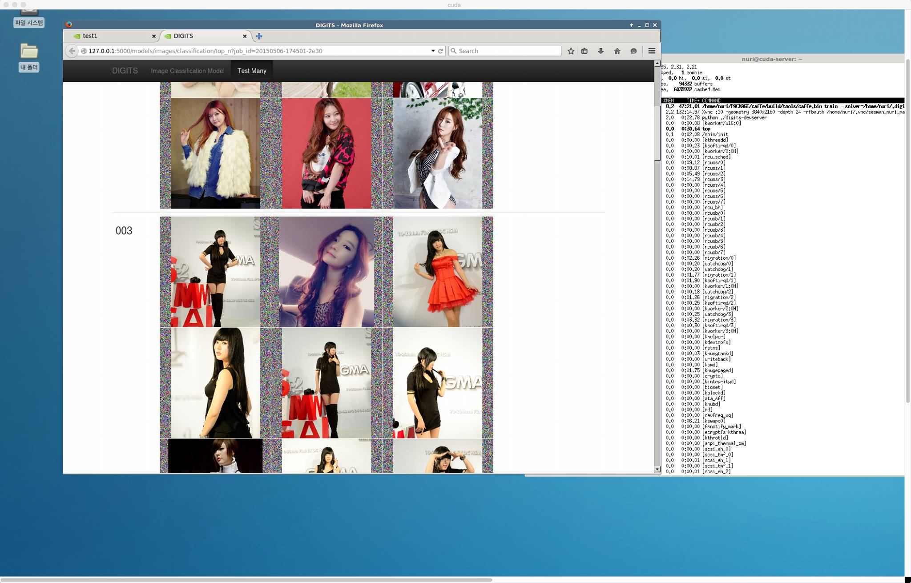
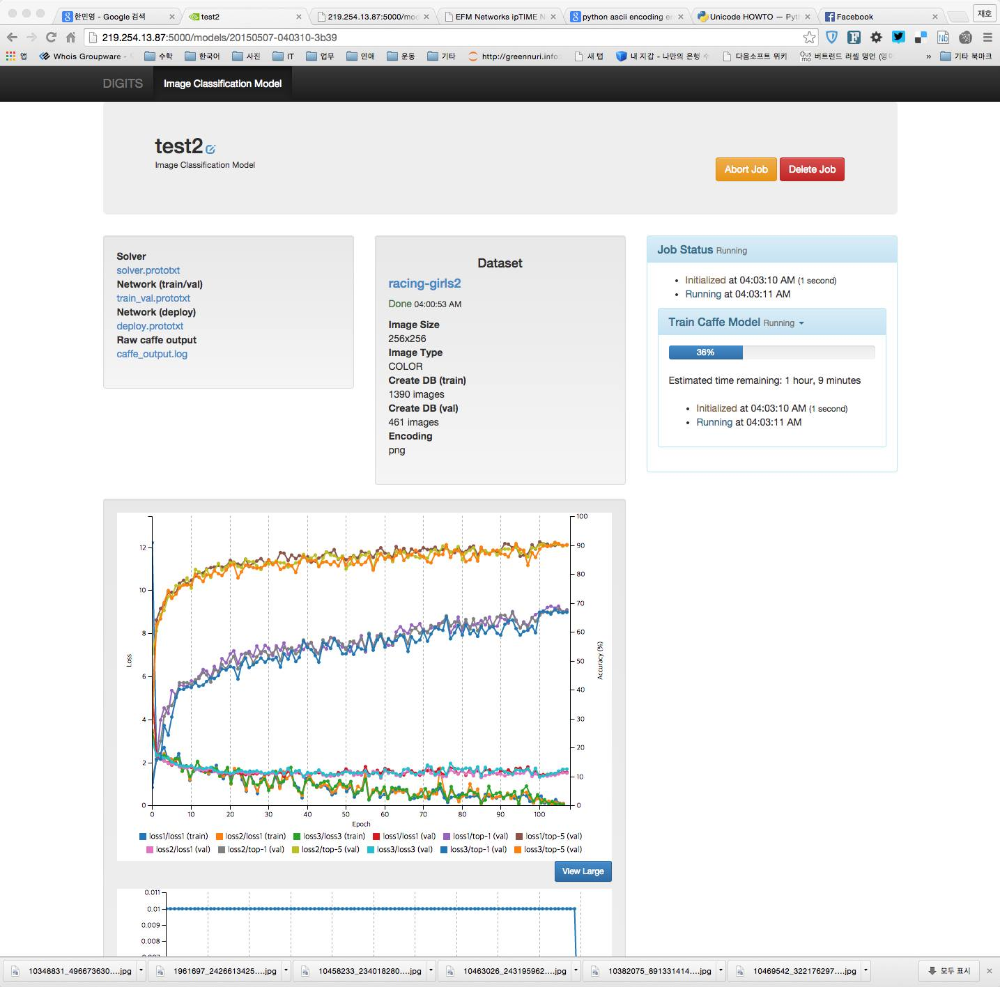

#재 시작.(2015)
재시작
>네이버 DEVIEW에서 관련 발표 청강, 질의 응답에서 파인 튜닝 개념을 적용한 사례가 있다는것 듣고
>적용해 볼까 고민..
>기왕하는거 이전에는 얼굴뿐만 아니라 사진을 그대로 다 집어 넣었는데..
>이번엔 얼굴만 넣어 보자.

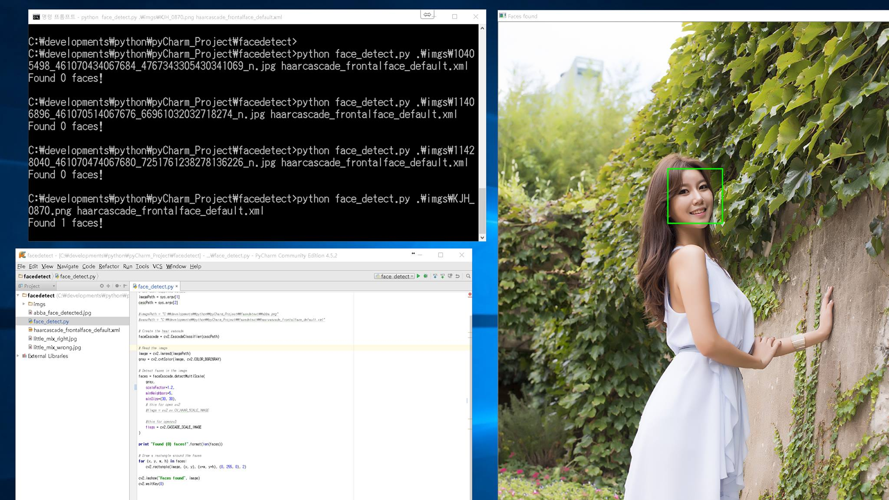

데이터 전처리
>opencv 이용 얼굴 인식 모듈 찾아서 수정.( python)
>기존에 사진 찎었던것들도 이용하자 
>raw 파일을 jpg로 변환 모듈 찾아서 수정.(python)
>기존의 사진들에서 인물만 싹 모아서 데이터셋 구성중.

데이터 수집 방안
>기존의 촬영한 사진과 수집된 사진은 양이 작음...
>못해도 인물 한명당 사진이 1000은 기본으로 있어야 할것 같은데.... 
>SNS(instagram, facebook)을 통해서 해당 인물이 올린 사진을 다운로드 받자...
>근데 어떻게????
>웹에서 관련 내용 찾아서 스크랩 (웹에 왠만한건 다 있네 ^^)
>SNS에서 사진 수집이 가능하면...
>과거의 사진 + 현재 사진까지 더해져서 판별력이 증가???
>해봐야 알지... 쩝^^

현 상태에서 예상되는 문제점.
>1. 데이터가 클래스마다 균등하게 배분되어 있지 않다.
>어떤 인물은 사진이 수천, 수만장(예전에 찍었던거 다 동원하면) 
>어떤 인물은 겨우 두자리 넘는...
>2. sns에서 사진 수집 어떻게?
>관련 코드나 동영상을 수집해도 잘 될런지.... 흠흠...
     
향후 작업.
>데이터 전처리.
>디렉토디 구성
>raw -> jpg 변환
>jpg -> 얼굴 인식, 얼굴만 자른 jpg 변환.

DIGITS 적용.
>웹 페이지 작성. 
>>사진을 올리면 얼굴을 인식하고, 그 얼굴에서 해당하는 인물에 대한 이름을 표시. 

2015. 09. 29
>OpenCV를 이용한 haar Clasifier를 통해 사진에서 안면 인식, 해당 부분을 따로 저장하는 모듈 작성. 
>안면을 인식하여 저장하는 모듈 수행 결과
>좀 안 애매... 
>안면을 인식 못하는 경우와 오인식 되는 경우가 상당히 많음.. 
>특히 여성 사진이 대부분이라서 흉부를 인식하는 경우도(^^)
>안면인식하는 모듈에 대해 좀 더 인식률이 높은 모듈이나 방법을 강구.

안면 추출 사진 정리.
>오인식 된 사진을 제거.

OpenCV에서 읽어 들인 이미지에 회전 적용 안면 인식.
>OpenCV에서는 이미지 파일을 읽어 들인후, Exif에 있는 회전 정보가 적용되지 않음.
>회전 정보가 적용되지 않은 상태에서 얼굴인식 모듈 돌리면, 결과가 안 좋음
>exif에서 회전정보를 읽어 들인후 openCV에서 읽어 들인 image 객체에 회전 적용 후,
>얼굴인식 모듈 적용.

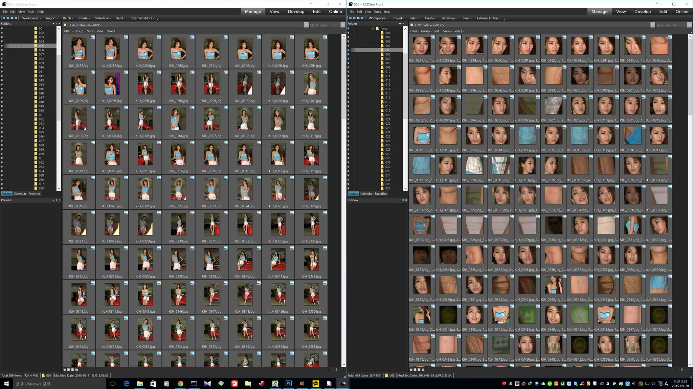
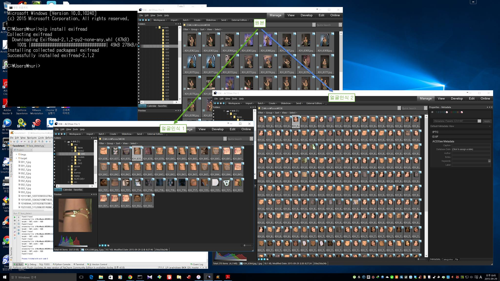

이제까지 한 결론... 
>CNN으로 안면인식 하기 위한 데이터가 좀 안 좋았고, 데이타 대상도 좀 안 좋았다. 

# 
우선.. 안면 인식은 어렵다... 
그리고 데이타 대상이 구분하기 어렵다. 
[이유](http://jbhuang0604.blogspot.kr/2013/04/miss-korea-2013-contestants-face.html) 앞의 링크를 보면 
미스코리아 대구 진출한 분들의 얼굴에 대한 egin factor를 추출하면 예상외로 factor가 적다...

위 그림은 미스코리아 대구 진출자들에 대해서 구분하기 위한 eigen 값이 몇개나 있는지 확인 한 결과를 표시한 그래프이다. 
보다시피 eigen factor가 7개 이상이되면서 의미 없게 되고 
실질적으로  eign factor는 6개가 된다. 

이런 이유 떄문에 개인 개인 구분하기가 좀 애매할때도 있다(사람도 애매....)
그걸 기계로 학습 시키기에는 데이터양과 CNN 모델의 복잡도가 떨어짐.

더 자세한 설명은 [링크](http://t-robotics.blogspot.kr/2013/07/pca.html#.V2uWFLiLQuU)를 참고 ^^ 

#참고 코드 
[raw2png](./source/raw2png.py)
> DSLR RAW 파일을 png 파일로 변환. 
> rawpy, imageio 패키지 필요

[그림 회전](./source/face_util.py)
> exifread, opencv2 패키지 필요 
[그림 회전 및 얼굴 추출](./source/face_detect2.py)

    