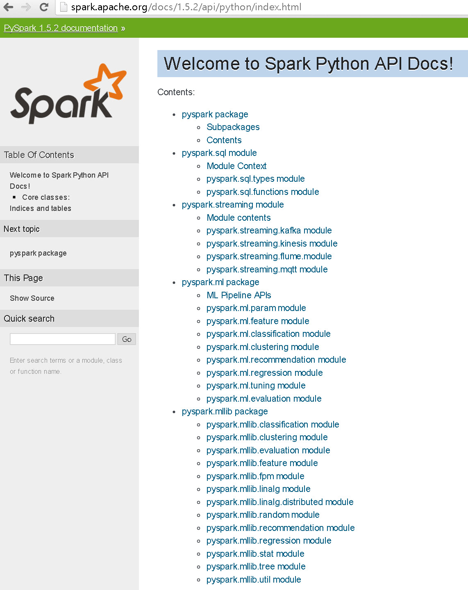

#SPARK로 추천 시스템 러프하게(^^) 구현하기 
[SPARK를 이용한 추천 시스템 구현 part1](https://www.codementor.io/spark/tutorial/building-a-recommender-with-apache-spark-python-example-app-part1)

[SPARK를 이용한 추천 시스템 구현 part2](https://www.codementor.io/spark/tutorial/building-a-recommender-with-apache-spark-python-example-app-part2)

[SPARK ML Lib를 이용한 추천](https://github.com/databricks/spark-training/blob/master/website/movie-recommendation-with-mllib.md)

여기의 내용은 위의 세 링크 내용을 제가 구현하면서 삽질한것을 공유 합니다. ^^ 

온갖 삽질 다 했네요 ^^ 

이 문서는 SPARK 1.5.2 버젼을 기준으로 작업 합니다. 

1. 추천을 위한 기계학습 라이브러리 선정
	SPARK는 SAPRK ML-LIB를 통해 기계학습 라이브러리들을 제공합니다. 
    그중에서 추천 시스템을 위한 라이브러리는 ALS라는 라이브러리가 있고요 
    이 라이브러리는 Matrix Factorization(행렬분해)라는 기법을 이용한 추천 알고리즘입니다. 
    자세한 내용은 [이곳](http://rosaec.snu.ac.kr/meet/file/20120728b.pdf)을 참고 하세요~ 
    
    
    위의 그림에서 API 목록 중에서 recommendation이 두군데 있습니다. 
    pyspark.ml package, pyspark.mllib package 
    이 두 패키지의 차이는 SPARK 에서 다음과 같이 이야기 합니다. 

>MLlib is Spark’s machine learning (ML) library. Its goal is to make practical machine learning scalable and easy. It consists of common learning algorithms and utilities, including classification, regression, clustering, collaborative filtering, dimensionality reduction, as well as lower-level optimization primitives and higher-level pipeline APIs.

>It divides into two packages:

>spark.mllib contains the original API built on top of RDDs.
spark.ml provides higher-level API built on top of DataFrames for constructing ML pipelines.

>Using spark.ml is recommended because with DataFrames the API is more versatile and flexible. But we will keep supporting spark.mllib along with the development of spark.ml. Users should be comfortable using spark.mllib features and expect more features coming. Developers should contribute new algorithms to spark.ml if they fit the ML pipeline concept well, e.g., feature extractors and transformers.

    
    
2. 추천을 위한 모델 학습
3. 추천을 서비스 하기 