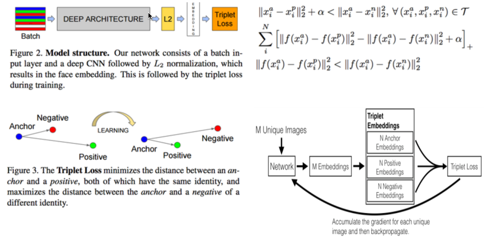

#얼굴인식
##papers

###triplet base face recongnition
[facenet](https://www.google.co.kr/url?sa=t&rct=j&q=&esrc=s&source=web&cd=1&cad=rja&uact=8&ved=0ahUKEwjpl8LihZPOAhWCnpQKHdWvBCgQFggiMAA&url=https%3A%2F%2Farxiv.org%2Fabs%2F1503.03832&usg=AFQjCNHYa3LolmPkb50-e0O0ZbYienrCHw&sig2=9URKS2-5R-Zlw-0TWwVkRQ)

[openface](https://www.google.co.kr/url?sa=t&rct=j&q=&esrc=s&source=web&cd=2&cad=rja&uact=8&ved=0ahUKEwiOhujzhZPOAhULnZQKHfP9DJEQFggqMAE&url=https%3A%2F%2Fcmusatyalab.github.io%2Fopenface%2F&usg=AFQjCNGOSwzQEKPbGFevqdL86LRbGVpMOA&sig2=g3l6-NPHfU5Xp3tru1sURQ)

###Rank Order base Clustering 
[Clustering Millions of Faces by Identity](https://www.google.co.kr/url?sa=t&rct=j&q=&esrc=s&source=web&cd=1&cad=rja&uact=8&ved=0ahUKEwjr4cmihpPOAhVDnZQKHfXyBysQFgghMAA&url=http%3A%2F%2Farxiv.org%2Fabs%2F1604.00989&usg=AFQjCNHONHZcOYuyo-URJG0sTtsOaYRrMw&sig2=IyGjjK1-FXBTtZnIOhegyw)

[An Efficient Approach for Clustering Face Images](https://www.google.co.kr/url?sa=t&rct=j&q=&esrc=s&source=web&cd=3&cad=rja&uact=8&ved=0ahUKEwjr4cmihpPOAhVDnZQKHfXyBysQFgg4MAI&url=http%3A%2F%2Fwww.cse.msu.edu%2Frgroups%2Fbiometrics%2FPublications%2FFace%2FOttoKlareJain_EfficientApproachClusteringFaceImages_ICB15.pdf&usg=AFQjCNFs1coAd4mb_Vf70ug-_Fajoxu6Ew&sig2=2RmhtN2TFZEGjV4jATbHkA)

[A Rank-Order Distance based Clustering Algorithm for Face Tagging](https://www.google.co.kr/url?sa=t&rct=j&q=&esrc=s&source=web&cd=1&cad=rja&uact=8&ved=0ahUKEwjm8JH2hpPOAhUGsJQKHfn2CdkQFggfMAA&url=http%3A%2F%2Fieeexplore.ieee.org%2Fiel5%2F5968010%2F5995307%2F05995680.pdf%3Farnumber%3D5995680&usg=AFQjCNEiWudGhK0PQ73HCjIdI7VMm0tM6A&sig2=fMDPjkeiJk13HVR4lE9k1Q)

[Rank Order Base Clustering](https://www.google.co.kr/url?sa=t&rct=j&q=&esrc=s&source=web&cd=1&cad=rja&uact=8&ved=0ahUKEwjr2qHchpPOAhUHnZQKHWIwADoQtwIIIjAA&url=https%3A%2F%2Fwww.youtube.com%2Fwatch%3Fv%3DTITJ6Q0iCOc&usg=AFQjCNHX1Q033OuJNR7lSfbI5cRU_f63aQ&sig2=fWW77AFvkRa2_CMNVpNiBw)
Mod-01 Lec-08 Rank Order Clustering, Similarity Coefficient based ...

이 아저씨 영어 발음이 이상한지 알아 듣기가 힘든데.. 그림을 이해... 
