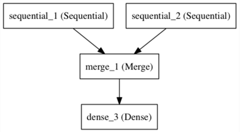

#Keras 순차모델로 시작하기 
순차모델은 선형적으로 차원을 쌓은 형태

Sequential모델의 생성자로서 레이어 인스턴스 리스트를 보내서 모델을 생성할 수 있다. 

```
from keras.models import Sequential<br>
form keras.layers import Dense, Activation<br>

model = Sequential([<br>
	Dense(32, input_dim=784),<br>
	Activations('relu'),<br>
	Dense(10),<br>
	Activations('softmax'),<br>
])
```

add()메소드를 이용하여 다음과 같이 간단하게 할 수 있다. 

`
model = Sequential()<br>

model.add(Dense(32, input_dim=784))<br>

model.add(Activation('relu'))<br>
`

##입력값 정의하기 
모델은 입력값에 대한 정의가 필요하다. 이러한 이유 때문에 순차 모델의 첫번째 레이어는 사용자로부터 입력에 대한 정보를 주어져야 한다. 

input_shape<br>
첫번째 레이어에 입력값 정의<br>
이것은 shape 튜플(integer이나 None값, None값은 양의 정수 아무 값이나 가능함)을 인자값으로 받는다.<br>
input_shape에서 batch 차원은 포함하지 않는다. 
<br>
<br>
batch_input_shape<br>
batch_input_shape는 input_shape에 batch_size를 추가한 것.<br>
이것은 고정된 batch_size를 정의하기에 유용하다. <br>

input_dim
일부 2차원 레이어에서 Dense와 같은 레이어에서 입력값에 대한 정의를 수행 

그리고 3차원 레이어에서 여유의 레이어는 input_dim, input_length 두개의 입력값을 사용

다음과 같은 세개의 예제 코드를 통해 확인 할 수 있다. 
```
model = Sequentia
model.add(Dense(32,input_shape(784,)))
model = Sequential()
model.add(Dense(32,batch_input_shape(None,784)))
model = Sequential()
model.add(Dense(32,input_dim=784))
```
그리고 다음과 같은 세개의 예제도 있다. 

```
model = Sequential()
model.add(LSTM(32,input_shape=(10,64)))

model = Sequential()
model.add(LSTM(32,batch_input_shape=(None,10,64)))

model = Sequential()
model.add(LSTM(32,input_length=10, input_dim=64))
```

레이어 합치기 

다수의 순차 모델 인스턴스를 합혀서 하나의 아웃풋을 만드는 네트워크로 Merge 레이어를 통해 하나의 단일 아웃풋을 만들어 낼 수 있다. 

아웃풋은 순차 모델의 첫번째 레이어로 추가 한다. 다음과 같은 예제에서 두개의 가지를 하나의 네트워크를 만드는 코드를 보여준다. 

```
from keras.layers import Merge<br>

left_branch = Sequential()<br>
left_branch.add(Dense(32, input_dim=784))<br>

right_branch = Sequential()<br>
right_branch.add(Dense(32, input_dim=784))<br>

merged = Merge([left_branch, right_branch], mode='concat')<br>

final_model = Sequential()<br>
final_model.add(merged)<br>
final_model.add(Dense(10, activation='softmax'))<br>
```



Merge레이어는 이미 정의된 다음과 같은 기능을 지원한다. 

sum(기본값) element-wise 덧셈 <br>
concat : 텐서 접합 연산, 텐서를 접합하는 방향을 concat_axis 인자를 통해 설정 가능하다<br>
mul: element-wise 곱셈<br>
ave: tensor 평균값<br>
dot:dot 연산, dot연산의 중심축은 dot_axes 인자를 통해 설정 가능<br>
cos: 2차원 텐서간의 코사인 근접도<br>
mode : 사용자 정의 함수<br>

>merged = Merge([left_branch, right_branch], mode=lambda x, y : x - y)

Sequential, Merge를 통해서도 표현 불가능한 모델이라면 Keras의 Functional API를 이용하여 직접 구현. 


#Compilation
모델을 학습 시키기전에, 학습과정을 정의해야 한다. 
그 과정은 compile함수를 호출함으로서 완성된다.
compile() 함수는 세가지의 인자를 가진다. 

optimizer : 최적화 설정(클래스명 혹은 클래스 인스턴스) 

>loss function : loss function (loss function name, instance of loss function)

metrics  : 평가척도, 어떠한 분류 문제어서든 이 값은 metric['accuravy']를 설정한다. 
척도값은 이미 존재하는 문자열 혹은 사용자 정의 함수로 정의 할 수 있다. 


```
for a multi-class classification problem<br>
model.compile(optimizer='rmsprop', <br>
	loss='categorical_crossentropy',<br>
	metrics=['accuracy'])<br>

for a binary classification problem<br>
model.compile(optimizer='rmsprop',<br>
	loss='binary_crossentropy',<br>
	metrics=['accuracy'])<br>

for a mean squared error regression problem<br>
model.compile(optimizer='rmsprop',<br>
	loss='mse')<br>
```

#Training
Keras 모델은 입력 데이타로서 Numpy의 배열을 입력 데이타와 라벨로 사용한다. 
모델 학습시, fit 함수를 사용한다. 
Read its documentation here.
```
for a single-input model with 2 classes (binary)

model = Sequential()<br>
model.add(Desse(1, input_dim=784, activation='softmax'))<br>
model.compile(optimizer='rmsprop',<br>
	loss='binary_crossentropy',<br>
	metrics=['accuracy'])<br>
<p>	
generate dummy data<br>
import numpy as np<br>
data = np.random.random((1000,784))<br>
labels = np.random.randint(2,size=(1000,1))<br>

train the model, Iterating on the data in batches
of 32 samples

model.fit(data, labels, nb_epoch=10, batch_size=32)<br>
```
#Examples
예제 테스트 코드 
examples 디렉토리에서 샘플 코드및 실 데이터를 확인 할 수 있다. <br>
>CIFAR10 small images classification Convolution Neural Network(CNN) with realtime data augmentation<br>
IMDB movie review sentiment classification : LSTM over sequences of words<br>
Reuters newswires topic classification Multilayer Perceptrol(MLP)<br>
MNIST handwritten digits classification : MLP & CNN <br>
CHaracter-level text generation with LSTM<br>
.... and more 

#Multilayer Perceptron(MLP) for multi-class softmax classification:
```
from keras.models import Sequential
from keras.layers import Dense, Dropout, Activation
from keras.optimizers import SGD

model = Sequential()
# Dense(64) is a fully-connected layer with 64 hidden units.
# in the first layer, you must specify the expected input data shape:
# here, 20-dimensional vectors.
model.add(Dense(64, input_dim=20, init='uniform'))
model.add(Activation('tanh'))
model.add(Dropout(0.5))
model.add(Dense(64, init='uniform'))
model.add(Activation('tanh'))
model.add(Dropout(0.5))
model.add(Dense(10, init='uniform'))
model.add(Activation('softmax'))

sgd = SGD(lr=0.1, decay=1e-6, momentum=0.9, nesterov=True)
model.compile(loss='categorical_crossentropy',
              optimizer=sgd,
              metrics=['accuracy'])

model.fit(X_train, y_train,
          nb_epoch=20,
          batch_size=16)
score = model.evaluate(X_test, y_test, batch_size=16)
```

#Alternative implementation of a similar MLP:
```
model = Sequential()<br>
model.add(Dense(64, input_dim=20, activation='relu'))<br>
model.add(Dropout(0.5))<br>
model.add(Dense(64, activation='relu'))<br>
model.add(Dropout(0.5))<br>
model.add(Dense(10, activation='softmax'))<br>

model.compile(loss='categorical_crossentropy',<br>
              optimizer='adadelta',<br>
              metrics=['accuracy'])<br>
```

#MLP for binary classification:

```
model = Sequential()<br>
model.add(Dense(64, input_dim=20, init='uniform', activation='relu'))<br>
model.add(Dropout(0.5))
model.add(Dense(64,activation='relu'))
model.add(Dropout(0.5))
model.add(Dense(1,activation='sigmoid'))

model.compile(loss='binary_crossentropy',
	optimizer='rmsprop',
	metrics=['accuracy'])
```

#VGG-like convnet:

```
from keras.models import Sequential
from keras.layers import Dense, Dropout, Activation, Flatten
from keras.layers import Convolution2D, MaxPooling2D
from keras.optimizers import SGD

model = Sequential()
# input: 100x100 images with 3 channels -> (3, 100, 100) tensors.
# this applies 32 convolution filters of size 3x3 each.
model.add(Convolution2D(32, 3, 3, border_mode='valid', input_shape=(3, 100, 100)))
model.add(Activation('relu'))
model.add(Convolution2D(32, 3, 3))
model.add(Activation('relu'))
model.add(MaxPooling2D(pool_size=(2, 2)))
model.add(Dropout(0.25))

model.add(Convolution2D(64, 3, 3, border_mode='valid'))
model.add(Activation('relu'))
model.add(Convolution2D(64, 3, 3))
model.add(Activation('relu'))
model.add(MaxPooling2D(pool_size=(2, 2)))
model.add(Dropout(0.25))

model.add(Flatten())
# Note: Keras does automatic shape inference.
model.add(Dense(256))
model.add(Activation('relu'))
model.add(Dropout(0.5))

model.add(Dense(10))
model.add(Activation('softmax'))

sgd = SGD(lr=0.1, decay=1e-6, momentum=0.9, nesterov=True)
model.compile(loss='categorical_crossentropy', optimizer=sgd)

model.fit(X_train, Y_train, batch_size=32, nb_epoch=1)
```

#Sequence classification with LSTM:

```
from keras.models import Sequential
from keras.layers import Dense, Dropout, Activation
from keras.layers import Embedding
from keras.layers import LSTM

model = Sequential()
model.add(Embedding(max_features, 256, input_length=maxlen))
model.add(LSTM(output_dim=128, activation='sigmoid', inner_activation='hard_sigmoid'))
model.add(Dropout(0.5))
model.add(Dense(1))
model.add(Activation('sigmoid'))

model.compile(loss='binary_crossentropy',
              optimizer='rmsprop',
              metrics=['accuracy'])

model.fit(X_train, Y_train, batch_size=16, nb_epoch=10)
score = model.evaluate(X_test, Y_test, batch_size=16)
```

#Architecture for learning image captions with a convnet and a Recurrent Unit:

(word-level embedding, caption of maximum length 16words.)

Note that getting this to work well will require using bigger convnet, initialized with pre-trained weights.

```
max_caption_len = 16
vocab_size = 10000

# first, let's define an image model that
# will encode pictures into 128-dimensional vectors.
# it should be initialized with pre-trained weights.
image_model = Sequential()
image_model.add(Convolution2D(32, 3, 3, border_mode='valid', input_shape=(3, 100, 100)))
image_model.add(Activation('relu'))
image_model.add(Convolution2D(32, 3, 3))
image_model.add(Activation('relu'))
image_model.add(MaxPooling2D(pool_size=(2, 2)))

image_model.add(Convolution2D(64, 3, 3, border_mode='valid'))
image_model.add(Activation('relu'))
image_model.add(Convolution2D(64, 3, 3))
image_model.add(Activation('relu'))
image_model.add(MaxPooling2D(pool_size=(2, 2)))

image_model.add(Flatten())
image_model.add(Dense(128))

# let's load the weights from a save file.
image_model.load_weights('weight_file.h5')

# next, let's define a RNN model that encodes sequences of words
# into sequences of 128-dimensional word vectors.
language_model = Sequential()
language_model.add(Embedding(vocab_size, 256, input_length=max_caption_len))
language_model.add(GRU(output_dim=128, return_sequences=True))
language_model.add(TimeDistributedDense(128))

# let's repeat the image vector to turn it into a sequence.
image_model.add(RepeatVector(max_caption_len))

# the output of both models will be tensors of shape (samples, max_caption_len, 128).
# let's concatenate these 2 vector sequences.
model = Sequential()
model.add(Merge([image_model, language_model], mode='concat', concat_axis=-1))
# let's encode this vector sequence into a single vector
model.add(GRU(256, return_sequences=False))
# which will be used to compute a probability
# distribution over what the next word in the caption should be!
model.add(Dense(vocab_size))
model.add(Activation('softmax'))

model.compile(loss='categorical_crossentropy', optimizer='rmsprop')

# "images" is a numpy float array of shape (nb_samples, nb_channels=3, width, height).
# "captions" is a numpy integer array of shape (nb_samples, max_caption_len)
# containing word index sequences representing partial captions.
# "next_words" is a numpy float array of shape (nb_samples, vocab_size)
# containing a categorical encoding (0s and 1s) of the next word in the corresponding
# partial caption.
model.fit([images, partial_captions], next_words, batch_size=16, nb_epoch=100)
```

#Stacked LSTM for sequence classification

In this model, we stack 3 LSTM layers on top of each other, making the model capable of learning higher-level temporal representations.

The first two LSTMs return their full output sequences, but hte last one only returns the last step in its output sequence, thus dropping the remporal dimension(i.e. converting the input sequence into a single vector).


```
from keras.models import Sequential
from keras.layers import LSTM, Dense
import numpy as np

data_dim = 16
timesteps = 8
nb_classes = 10

# expected input data shape: (batch_size, timesteps, data_dim)
model = Sequential()
model.add(LSTM(32, return_sequences=True,
               input_shape=(timesteps, data_dim)))  # returns a sequence of vectors of dimension 32
model.add(LSTM(32, return_sequences=True))  # returns a sequence of vectors of dimension 32
model.add(LSTM(32))  # return a single vector of dimension 32
model.add(Dense(10, activation='softmax'))

model.compile(loss='categorical_crossentropy',
              optimizer='rmsprop',
              metrics=['accuracy'])

# generate dummy training data
x_train = np.random.random((1000, timesteps, data_dim))
y_train = np.random.random((1000, nb_classes))

# generate dummy validation data
x_val = np.random.random((100, timesteps, data_dim))
y_val = np.random.random((100, nb_classes))

model.fit(x_train, y_train,
          batch_size=64, nb_epoch=5,
          validation_data=(x_val, y_val))
```

#Same stacked LSTM model, rendered "stateful"

A stateful recurent model is one for which the internal stated (momories) obtained after processing a batch of samples are reused as initial states for the samples of the next batch.<br>
This allows to process longer sequences while keeping computational complexity manageable. 

#You can read more about stateful RNNs in the FAQ 

```
from keras.models import Sequential
from keras.layers import LSTM, Dense
import numpy as np

data_dim = 16<br>
timesteps = 8<br>
nb_classes = 10<br>
batch_size = 32<br>

# expected input batch shape: (batch_size, timesteps, data_dim)
# note that we have to provide the full batch_input_shape since the network is stateful.
# the sample of index i in batch k is the follow-up for the sample i in batch k-1.
model = Sequential()<br>
model.add(LSTM(32, return_sequences=True, stateful=True,<br>
               batch_input_shape=(batch_size, timesteps, data_dim))<br>)
model.add(LSTM(32, return_sequences=True, stateful=True))<br>
model.add(LSTM(32, stateful=True))<br>
model.add(Dense(10, activation='softmax'))<br>

model.compile(loss='categorical_crossentropy',<br>
              optimizer='rmsprop',<br>
              metrics=['accuracy'])<br>

'# generate dummy training data<br>
x_train = np.random.random((batch_size * 10, timesteps, data_dim))<br>
y_train = np.random.random((batch_size * 10, nb_classes))<br>

'# generate dummy validation data<br>
x_val = np.random.random((batch_size * 3, timesteps, data_dim))<br>
y_val = np.random.random((batch_size * 3, nb_classes))<br>

model.fit(x_train, y_train,<br>
          batch_size=batch_size, nb_epoch=5,<br>
          validation_data=(x_val, y_val))<br>
```

#Two merged LSTM encoders for classification over two parallel sequences 

In this model, wo input sequences are encoded into vectors by two seperate LSTm modules. 
These two vectors are then concatenated, and a fully connected network is trained on top of the concatenated represenrations.


```
from keras.models import Sequential<br>
from keras.layers import Merge, LSTM, Dense<br>
import numpy as np<br>

data_dim = 16<br>
timesteps = 8<br>
nb_classes = 10<br>

encoder_a = Sequential()<br>
encoder_a.add(LSTM(32, input_shape=(timesteps, data_dim)))<br>

encoder_b = Sequential()<br>
encoder_b.add(LSTM(32, input_shape=(timesteps, data_dim)))<br>

decoder = Sequential()<br>
decoder.add(Merge([encoder_a, encoder_b], mode='concat'))<br>
decoder.add(Dense(32, activation='relu'))<br>
decoder.add(Dense(nb_classes, activation='softmax'))<br>

decoder.compile(loss='categorical_crossentropy',<br>
                optimizer='rmsprop',<br>
                metrics=['accuracy'])<br>

# generate dummy training data<br>
x_train_a = np.random.random((1000, timesteps, data_dim))<br>
x_train_b = np.random.random((1000, timesteps, data_dim))<br>
y_train = np.random.random((1000, nb_classes))<br>

# generate dummy validation data<br>
x_val_a = np.random.random((100, timesteps, data_dim))<br>
x_val_b = np.random.random((100, timesteps, data_dim))<br>
y_val = np.random.random((100, nb_classes))<br>

decoder.fit([x_train_a, x_train_b], y_train,<br>
            batch_size=64, nb_epoch=5,<br>
            validation_data=([x_val_a, x_val_b], y_val))<br>
```