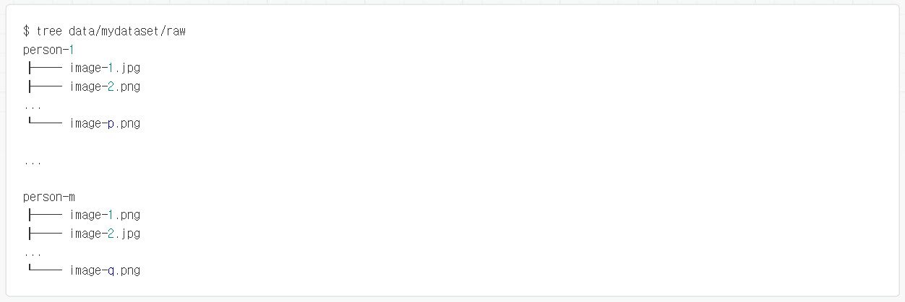
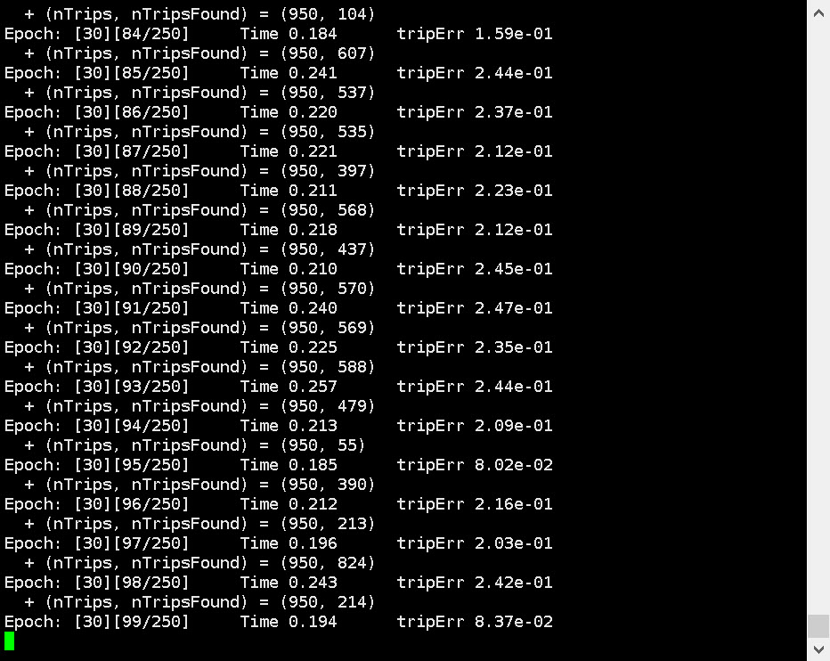
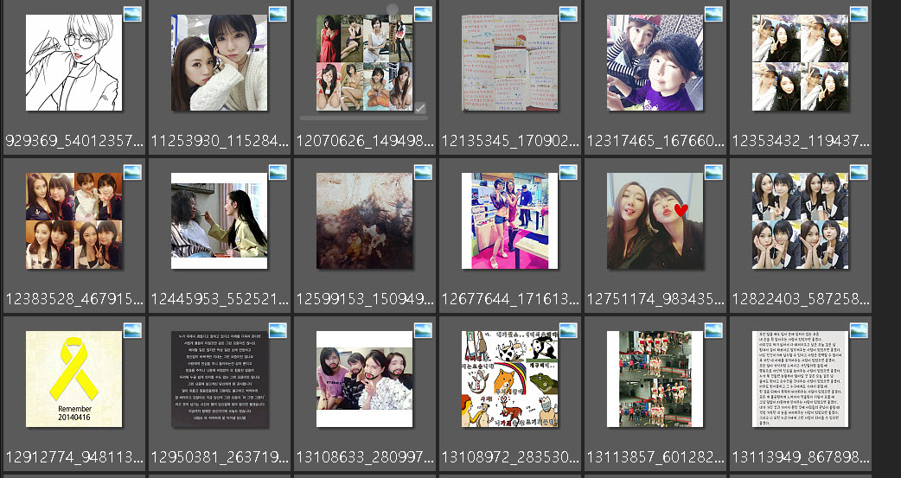
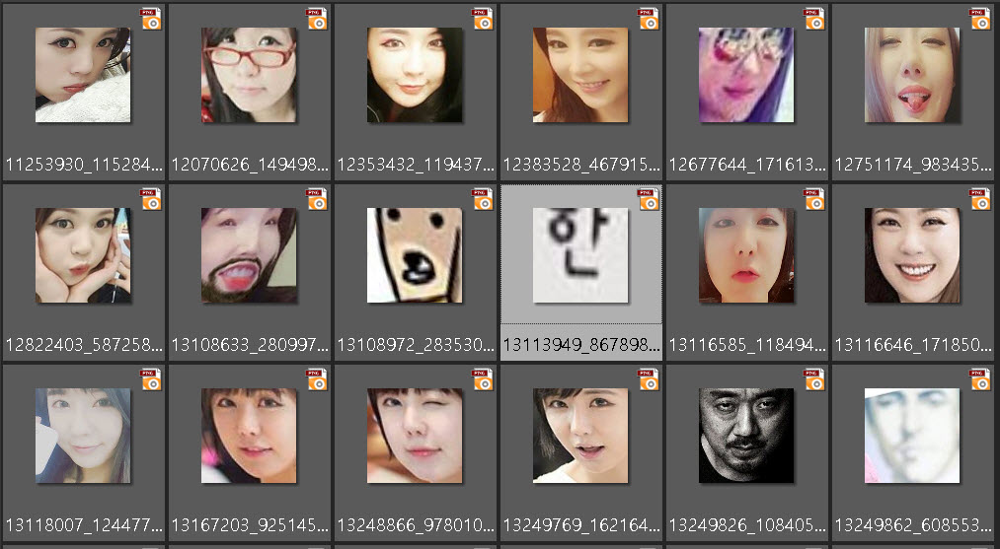

#openface dnn으로 학습하기 
# pre-trained dnn 모델을 이용한 학습. 
단순한 분류기만을 작성하기 위해서는 이 과정만으로 충분함. 

1. 데이터셋 디렉토리 만들기 

학습 하고자 하는 데이타를 위와 같은 형태의 디렉토리로 작성. 
인식하는 확장자는 jpg, png이며 소문자 여야 함. 

2. 전처리
`for N in {1..8}; do ./util/align-dlib.py <path-to-raw-data> align outerEyesAndNose <path-to-aligned-data> --size 96 & done.`
위와 같은 코드를 통해 전처리를 수행. 
align-dlib.py는 분석 예정 

3. representations 제작
`./batch-represent/main.lua -outDir <feature-directory> -data <path-to-aligned-data> creates reps.csv and labels.csv in <feature-directory>.
`
기존의 기계학습기 모델에서 특성(feature 추출)을 추출 하는 과정과 유사. 
batch-represent/main.lua 코드 분석 예정 

4. 분류기 모델 작성
`./demos/classifier.py train <feature-directory>`
classifier.py를 통해 분류기 모델을 학습. 
이 코드는 SVM 분류기 모델을 python 피클 파일로 저장. 
1000개 정도의 이미지에서 몇초간의 시간이 소요됨. 

5. 새로운 이미지 분류 
`./demos/classifier.py infer ./models/openface/celeb-classifier.nn4.small2.v1.pkl images/examples/{carell,adams,lennon}*`
기존에 작성된 분류기 모델을 이용하여 이미지를 분류 처리 
celeb-classifier.nn4.small2.v1.pkl : 기존 작성된 분류기 모델 

# 직접 training 학습.
이 과정은 많은 양의 이미지(약 50만 이상)을 통해 새로운 DNN 모델을 만들기 위한 가이드 
해당 블로그의 개발자에 의하면 Tesla K40을 이용해서 하루가 소요 되었다고 함...

1. 데이터셋 디렉토리 작성

학습 하고자 하는 데이타를 위와 같은 형태의 디렉토리로 작성. 
인식하는 확장자는 jpg, png이며 소문자여야 함. 

이미지 파일명은 {prefix}_0001.{jpg,png} 형식. 
{prefix}는 인물 명이나 혹은 다른 명칭으로 대체 가능.
숫자 카운트는 4자리 숫자로 맞춰야 함. 

이 형식을 맞추는 이유는 학습후, 모델에 대한 평가(evaloution) 코드에서 저 정보를 이용함.

2. 이미지 전처리
LFW(Labeled Face in th Wild)
LFW의 정확도를 계산 하려고 한다면, 당신의 데이터셋에서 LFW 아이덴티티를 제거 해야 한다. 
이를 위해서 다음과 같은 스크립트를 활용
`remove-lfw-names.py`

사용자 데이터셋에서 rgb 컬러가 아니거나 얼굴을 인식하는데 실패한 모듈을 제거한 데이터를 뽑아내는 코드 

`for N in {1..8}; do ./util/align-dlib.py <path-to-raw-data> align outerEyesAndNose <path-to-aligned-data> --size 96 & done`

위 코드에서 정제된 이미지가 3개(혹은 사용자 정의 수량) 보다 작을 경우 데이터셋을 정리 하는 코드 
`./util/prune-dataset.py <path-to-aligned-data> --numImagesThreshold 3.`

3. 모델 트레이닝
`training/main.lua` 모듈을 이용하여 학습을 수행. 
'training/opts.lua' 모듈은 학습을 수행하기 위한 설정 값

dataset option을 수정 해야 2단계에서 정제된 이미지가 저장된 경로를 액세스 함. 

학습 과정

그래픽카드 상태

##평가(evloution)
pairs.txt 파일에서 평가를 위한 비교 데이터를 입력 하고 
그것을 기준으로 평가함. 

###형식
평가횟수 TAB 평가셋 수량
1st match 리스트(평가셋 수량)
1st mismatch 리스트(평가셋 수량)
2nd match 리스트(평가셋 수량)
2nd mismatch 리스트(평가셋 수량)
-----
n th match 리스트 
n th mismatch 리스트 

####match 리스트 
{prefix} TAB number1 TAB number2
>{prefix}_number1 이미지와 {prefix}_number2는 같은 클래스

####mismatch 리스트 
{prefix1} TAB number1 TAB {prefix2} TAB number2
>{prefix1}_number1 이미지와 {prefix2}_number2 이미지는 다른 클래스 

4. 트레이닝 분석

#경과
학습률이 떨어져서 데이터셋을 확인 해보니 
2단계에서 얼굴 인식해서 데이터 정제 할때 얼굴이 아닌데 인식한 경우가 좀 된다. 
결국은 사람 손을 거치긴 해야 한다는 의미.. 

원본 데이타 일부 

필터링된 데이타 일부 

대부분 얼굴만 잘 가져오기는 하지만.... 
일부 오작동 된 부분도 보임..
