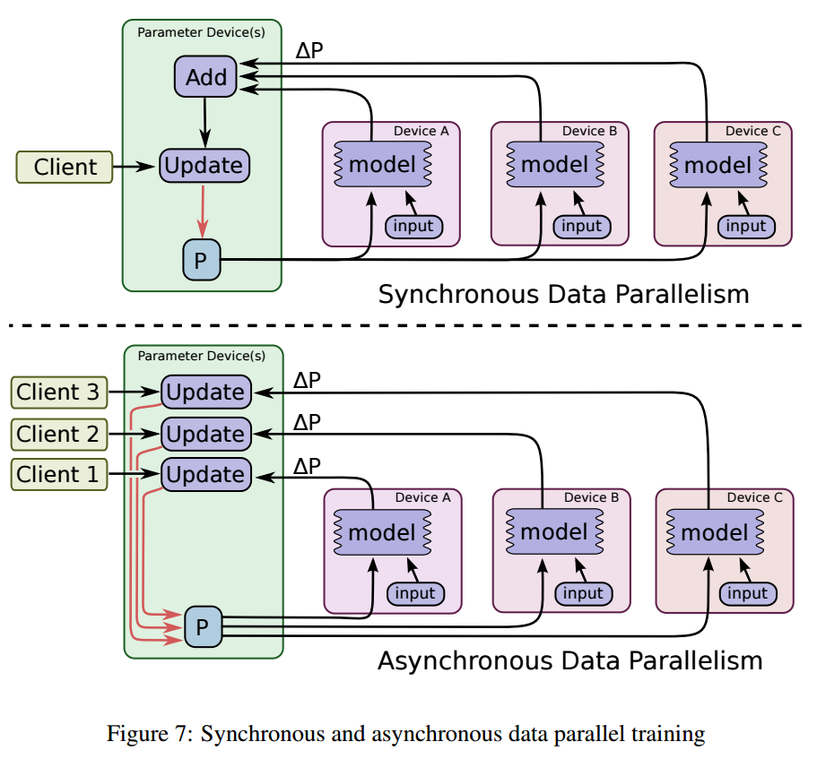
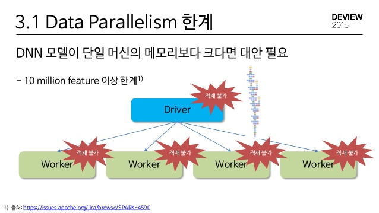
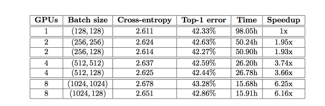
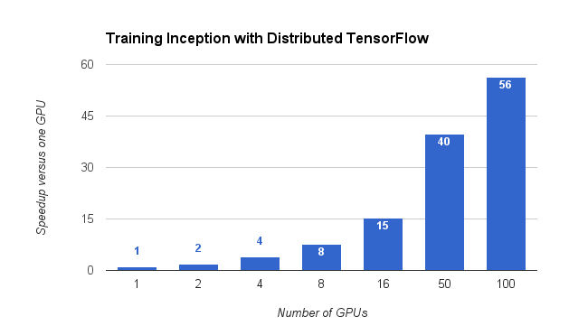

# Parallel Processing

Tensorflow 0.8 이후 버젼부터 분산 처리 지원(GPU)


텐서 플로에서 디바이스 지정 방법

/cpu:0 : 서버의 cpu를 지정

/gpu:0 : 서버의 첫번째 gpu 지정

/gpu:1 : 서버의 두번째 gpu 지정

/gpu:n : 서버의 n-1 번째 gpup 지정


연산 및 텐서가 어떤 디바이스에 할당되어 있느지 알고 싶다면 

```python
log.device.placement=True
```

위와 같이 지정 


```python
import tensorflow as tf
a = tf.constant([1.0, 2.0, 3.0, 4.0, 5.0, 6.0], shape=[2,3], name='a')
b = tf.constant([1.0, 2.0, 3.0, 4.0, 5.0, 6.0], shape=[3,2], name='b')
c = tf.matmul(a, b)

sess = tf.Session(config=tf.ConfigProto(log_device_placement=True))
print sess.run(c)
```


```python
I tensorflow/stream_executor/dso_loader.cc:128] successfully opened CUDA library libcublas.so locally
I tensorflow/stream_executor/dso_loader.cc:128] successfully opened CUDA library libcudnn.so locally
I tensorflow/stream_executor/dso_loader.cc:128] successfully opened CUDA library libcufft.so locally
I tensorflow/stream_executor/dso_loader.cc:128] successfully opened CUDA library libcuda.so.1 locally
I tensorflow/stream_executor/dso_loader.cc:128] successfully opened CUDA library libcurand.so locally
I tensorflow/core/common_runtime/gpu/gpu_device.cc:885] Found device 0 with properties:
name: GeForce GTX TITAN X
major: 5 minor: 2 memoryClockRate (GHz) 1.076
pciBusID 0000:02:00.0
Total memory: 11.92GiB
Free memory: 11.81GiB
W tensorflow/stream_executor/cuda/cuda_driver.cc:590] creating context when one is currently active; existing: 0x190d4f0
I tensorflow/core/common_runtime/gpu/gpu_device.cc:885] Found device 1 with properties:
name: GeForce GTX 970
major: 5 minor: 2 memoryClockRate (GHz) 1.2155
pciBusID 0000:05:00.0
Total memory: 3.94GiB
Free memory: 3.88GiB
I tensorflow/core/common_runtime/gpu/gpu_device.cc:777] Peer access not supported between device ordinals 0 and 1
I tensorflow/core/common_runtime/gpu/gpu_device.cc:777] Peer access not supported between device ordinals 1 and 0
I tensorflow/core/common_runtime/gpu/gpu_device.cc:906] DMA: 0 1
I tensorflow/core/common_runtime/gpu/gpu_device.cc:916] 0:   Y N
I tensorflow/core/common_runtime/gpu/gpu_device.cc:916] 1:   N Y
I tensorflow/core/common_runtime/gpu/gpu_device.cc:975] Creating TensorFlow device (/gpu:0) -> (device: 0, name: GeForce GTX TITAN X, pci bus id: 0000:02:00.0)
I tensorflow/core/common_runtime/gpu/gpu_device.cc:975] Creating TensorFlow device (/gpu:1) -> (device: 1, name: GeForce GTX 970, pci bus id: 0000:05:00.0)
Device mapping:
/job:localhost/replica:0/task:0/gpu:0 -> device: 0, name: GeForce GTX TITAN X, pci bus id: 0000:02:00.0
/job:localhost/replica:0/task:0/gpu:1 -> device: 1, name: GeForce GTX 970, pci bus id: 0000:05:00.0
I tensorflow/core/common_runtime/direct_session.cc:255] Device mapping:
/job:localhost/replica:0/task:0/gpu:0 -> device: 0, name: GeForce GTX TITAN X, pci bus id: 0000:02:00.0
/job:localhost/replica:0/task:0/gpu:1 -> device: 1, name: GeForce GTX 970, pci bus id: 0000:05:00.0

MatMul: (MatMul): /job:localhost/replica:0/task:0/gpu:0
I tensorflow/core/common_runtime/simple_placer.cc:827] MatMul: (MatMul)/job:localhost/replica:0/task:0/gpu:0
b: (Const): /job:localhost/replica:0/task:0/gpu:0
I tensorflow/core/common_runtime/simple_placer.cc:827] b: (Const)/job:localhost/replica:0/task:0/gpu:0
a: (Const): /job:localhost/replica:0/task:0/gpu:0
I tensorflow/core/common_runtime/simple_placer.cc:827] a: (Const)/job:localhost/replica:0/task:0/gpu:0
[[ 22.  28.]
 [ 49.  64.]]
```


특정 디바이스에서 지정된 연산이 실행 되도록 하고 싶다면 tf.device 변수를 사용하여 디바이스 컨텍스트를 작성

디바이스 컨텍스트 안의 모든 변수는 지정된 디바이스에 할당 됩니다. 

```python
import tensorflow as tf
with tf.device('/gpu:2'):
	a = tf.constant([1.0, 2.0, 3.0, 4.0, 5.0, 6.0], shape=[2,3], name='a')
	b = tf.constant([1.0, 2.0, 3.0, 4.0, 5.0, 6.0], shape=[3,2], name='b')
	c = tf.matmul(a, b)

sess = tf.Session(config=tf.ConfigProto(log_device_placement=True))
print sess.run(c)
```

위의 예제에서 a, b, c는 gpu2에 할당 됩니다. 


## 여러 GPU에서의 병렬 처리

```python
import tensorflow as tf
c = []

for d in ['/gpu:0', '/gpu:1']:
	with tf.device(d):
		a = tf.constant([1.0, 2.0, 3.0, 4.0, 5.0, 6.0], shape=[2,3], name='a')
		b = tf.constant([1.0, 2.0, 3.0, 4.0, 5.0, 6.0], shape=[3,2], name='b')
		c.append(tf.matmul(a,b))
	
with tf.device("/cpu:0"):
	sum = tf.add_n(c)
	
sess = tf.Session(config=tf.ConfigProto(log_device_placement=True))
print sess.run(sum)
```


```python
I tensorflow/core/common_runtime/gpu/gpu_device.cc:975] Creating TensorFlow device (/gpu:0) -> (device: 0, name: GeForce GTX TITAN X, pci bus id: 0000:02:00.0)
I tensorflow/core/common_runtime/gpu/gpu_device.cc:975] Creating TensorFlow device (/gpu:1) -> (device: 1, name: GeForce GTX 970, pci bus id: 0000:05:00.0)
Device mapping:
/job:localhost/replica:0/task:0/gpu:0 -> device: 0, name: GeForce GTX TITAN X, pci bus id: 0000:02:00.0
/job:localhost/replica:0/task:0/gpu:1 -> device: 1, name: GeForce GTX 970, pci bus id: 0000:05:00.0
I tensorflow/core/common_runtime/direct_session.cc:255] Device mapping:
/job:localhost/replica:0/task:0/gpu:0 -> device: 0, name: GeForce GTX TITAN X, pci bus id: 0000:02:00.0
/job:localhost/replica:0/task:0/gpu:1 -> device: 1, name: GeForce GTX 970, pci bus id: 0000:05:00.0

MatMul_1: (MatMul): /job:localhost/replica:0/task:0/gpu:1
I tensorflow/core/common_runtime/simple_placer.cc:827] MatMul_1: (MatMul)/job:localhost/replica:0/task:0/gpu:1
MatMul: (MatMul): /job:localhost/replica:0/task:0/gpu:0
I tensorflow/core/common_runtime/simple_placer.cc:827] MatMul: (MatMul)/job:localhost/replica:0/task:0/gpu:0
AddN: (AddN): /job:localhost/replica:0/task:0/cpu:0
I tensorflow/core/common_runtime/simple_placer.cc:827] AddN: (AddN)/job:localhost/replica:0/task:0/cpu:0
b_1: (Const): /job:localhost/replica:0/task:0/gpu:1
I tensorflow/core/common_runtime/simple_placer.cc:827] b_1: (Const)/job:localhost/replica:0/task:0/gpu:1
a_1: (Const): /job:localhost/replica:0/task:0/gpu:1
I tensorflow/core/common_runtime/simple_placer.cc:827] a_1: (Const)/job:localhost/replica:0/task:0/gpu:1
b: (Const): /job:localhost/replica:0/task:0/gpu:0
I tensorflow/core/common_runtime/simple_placer.cc:827] b: (Const)/job:localhost/replica:0/task:0/gpu:0
a: (Const): /job:localhost/replica:0/task:0/gpu:0
I tensorflow/core/common_runtime/simple_placer.cc:827] a: (Const)/job:localhost/replica:0/task:0/gpu:0
[[  44.   56.]
 [  98.  128.]]
```


#distributed Tensorflow

이 문서에는 https://tensorflowkorea.gitbooks.io/tensorflow-kr/content/g3doc/how_tos/distributed/ 링크의 문서를 엄청나게(90% 이상) 참조, 복북 하였음을 미리 공지합니다.

​		
**CUDA_ViSIBLE_DEVICES** 

Masking GPUs
시스템에 있는 gpu 장비를 프로그램에 할당 할때 마스킹을 하는 역할을 수행 

CUDA_VISIBLE_DEVICES=0 : 첫번째 장비만 표시 
CUDA_VISIBLE_DEVICES=1 : 두번째 장비만 표시 
CUDA_VISIBLE_DEVICES=0,1 : 첫번째, 두번째 장비 표시 

CUDA의 deviceQuery 실행 결과에 영향을 미쳐서 사용할 수 있는 장비를 바꿈

0 : Titan-X
1 : gtx 970 
0 번째 장비(Titan-x)만 사용할 경우 


```baSh
CUDA_VISIBLE_DEVICES=0 python source.py 

I tensorflow/stream_executor/dso_loader.cc:128] successfully opened CUDA library libcublas.so locally
I tensorflow/stream_executor/dso_loader.cc:128] successfully opened CUDA library libcudnn.so locally
I tensorflow/stream_executor/dso_loader.cc:128] successfully opened CUDA library libcufft.so locally
I tensorflow/stream_executor/dso_loader.cc:128] successfully opened CUDA library libcuda.so.1 locally
I tensorflow/stream_executor/dso_loader.cc:128] successfully opened CUDA library libcurand.so locally
I tensorflow/core/common_runtime/gpu/gpu_device.cc:885] Found device 0 with properties:
name: GeForce GTX TITAN X
major: 5 minor: 2 memoryClockRate (GHz) 1.076
pciBusID 0000:02:00.0
Total memory: 11.92GiB
Free memory: 11.81GiB
I tensorflow/core/common_runtime/gpu/gpu_device.cc:906] DMA: 0
I tensorflow/core/common_runtime/gpu/gpu_device.cc:916] 0:   Y
I tensorflow/core/common_runtime/gpu/gpu_device.cc:975] Creating TensorFlow device (/gpu:0) -> (device: 0, name: GeForce GTX TITAN X, pci bus id: 0000:02:00.0)
```


1 번째 장비(gtx970)만 사용할 경우 


```
CUDA_VISIBLE_DEVICES=1 python source.py 
I tensorflow/stream_executor/dso_loader.cc:128] successfully opened CUDA library libcublas.so locally
I tensorflow/stream_executor/dso_loader.cc:128] successfully opened CUDA library libcudnn.so locally
I tensorflow/stream_executor/dso_loader.cc:128] successfully opened CUDA library libcufft.so locally
I tensorflow/stream_executor/dso_loader.cc:128] successfully opened CUDA library libcuda.so.1 locally
I tensorflow/stream_executor/dso_loader.cc:128] successfully opened CUDA library libcurand.so locally
I tensorflow/core/common_runtime/gpu/gpu_device.cc:885] Found device 0 with properties:
name: GeForce GTX 970
major: 5 minor: 2 memoryClockRate (GHz) 1.2155
pciBusID 0000:05:00.0
Total memory: 3.94GiB
Free memory: 3.88GiB
I tensorflow/core/common_runtime/gpu/gpu_device.cc:906] DMA: 0
I tensorflow/core/common_runtime/gpu/gpu_device.cc:916] 0:   Y
I tensorflow/core/common_runtime/gpu/gpu_device.cc:975] Creating TensorFlow device (/gpu:0) -> (device: 0, name: GeForce GTX 970, pci bus id: 0000:05:00.0)

```

AWS 분산 텐서 플로우 
https://gist.github.com/haje01/b655a9f0e4b6389b504d6a4e03dea379

https://tensorflowkorea.gitbooks.io/tensorflow-kr/content/g3doc/how_tos/distributed/
https://github.com/tensorflow/models/blob/master/tutorials/image/cifar10/cifar10_multi_gpu_train.py


기존의 코드에서 멀티 gpu 이용하기 

tf.device()명령을 이용

```python
with tf.device("/gpu:0"):
	weights_1 = tf.Variable(...)
	biases_1 = tf.Variable(...)

with tf.device("/gpu:1"):
  weights_2 = tf.Variable(...)
  biases_2 = tf.Variable(...)

with tf.device("/gpu:2"):
  input, labels = ...
  layer1 = tf.nn.relu(tf.matmul(input, weights1) + biases_1)
  logits = tf.nn.relu(tf.matmul(layer1, weights2) + biases_2)
  train_op = 

with tf.Session() as sess:
  for _ in range(10000):
sess.run(train_op)

```

tf.Variable, tf.Const를 선언할때 gpu를 지정가능. 

해당 변수 혹은 상수 처리시 정의된 gpu를 사용. 

local server를 이용한 분산 텐서 플로우 


```python
'Start a TensorFlow server as a single-process "cluster".

import tensorflow as tf
c = tf.constant("Hello, distributed TensorFlow!")
server = tf.train.Server.create_local_server()
sess = tf.Session(server.target)  # Create a session on the server.
sess.run(c)

'Hello, distributed TensorFlow!'

```


[예제](https://github.com/tensorflow/tensorflow/blob/r0.7/tensorflow/models/image/cifar10/cifar10_multi_gpu_train.py)

위 코드에서 --num_gpus 인자 값이 1 이상이면, batch_size 만큼 데이터를 읽어 와서 gpu 마다 할당하여 작업을수행(위 그림과 같이)

tf.Variable, tf.Const를 선언할때 gpu를 지정가능.해당 변수 혹은 상수 처리시 정의된 gpu를 사용.


#  분산 텐서 플로우 

## 분산의 방법

1. 데이터 분산 처리 
2. 모델 분산 처리 

tensorflow 는 데이터처리 병렬화를 지원 


단일 머신에서의 분산 처리 





Cluster 구성 요소

Cluster 생성하기
텐서플로우에서 "클러스터"란 텐서플로우 그래프 상에서의 분산 연산의 일부로서 "작업(Task)"의 집합을 의미

각각의 작업은 텐서플로우 서버에 연관되어 있으며, 각 서버는 세션을 생성할 수 있는 "마스터"와 그래프 상에서 연산을 수행 하는 작업자로 구성됨.

각 클러스터는 복수개의 직무(job)로 구성되어 있으며, 각각의 직무는 복수개의 작업으로 이루어짐.

클러스터를 생성하기 위해서는, 작업 하나당 하나의 텐서 플로우 서버를 실행해야 하며 아래와 같은 절차를 거쳐서 진행

| 명칭     | 역할                                       |
| ------ | ---------------------------------------- |
| PS     | Parameter server, 신경망 학습된 값을 취합하고 갱신, 전체 작업을 조율 |
| worker | 작업자 연산을 수행                               |

\1. 클러스터에 할당된 작업을 설명하는 객체를 정의
\2. 서버를 생성하고, 서버에 클러스터에 할당된 작업을 부여

ClusterSpec 생성
클러스터 스펙은 tf.train.ClusterSpec 객체를 생성함으로써 정의 가능.
이 객체를 생성할때 python Dictionary형식으로 스펙을 지정해서 넘김.

| tf.train.ClusterSpec 생성자                 |      |
| ---------------------------------------- | ---- |
| tf.train.ClusterSpec({"local":["localhost:2222","localhost:2223"]}) |      |
| tf.train.ClusterSpec({"worker":["worker0.example.com:2222","worker1.example.com:2222","worker2.example.com:2222"],"ps":["ps0.example.com:2222","ps1.example.com:2222"]}) |      |

Cluster server 객체 생성
Cluster Server는 tf.train.Server객체를 생성 한다.

클러스터 서버는 여러개의 로컬 디바이스 정보와 각 작업과 디바이스를 연결해 주는 정보인 tf.train.ClusterSpec객체와 분산 연산 수행에 이용되는 "session target"을 포함한다.

서버는 특정한 이름이 부여된 직무의 멤버이며, 해당 직무에서 작업 인덱스를 가지고 이싿.
서버는 클러스터 내에 있는 다른 서버와 통신이 가능하다.
두개의 서버를 가지는 클러스터를 구동 하려면 아래와 같이 수행 하면 된다.

\#0번 작업
cluster = tf.train.SlusterSpec({"local":
["localhost:2222","localhost:2223"]})
server = tf.train.Server(cluster, job_name="local", task_index=0)

\#1번 작업
cluster = tf.train.SlusterSpec({"local":["localhost:2222","localhost:2223"]})
server = tf.train.Server(cluster, job_name="local", task_index=1)

위 두개의 코드를 개별 터미널에서 동작 시키면 각각 두개의 서버가 동작 하는 것을 볼 수 있다.
모델내에서 디바이스 명시
클러스터 모드에서 그래프내의 일정 부분을 다수개의 디바이스에 명시 할 수 있다.

```
  with tf.device("/job:ps/task:0"):
    weights_1 = tf.Variable(...)
    biases_1 = tf.Variable(...)

```

```
  with tf.device("/job:ps/task:1"):
    weights_2 = tf.Variable(...)
    biases_2 = tf.Variable(...)

```

```
  with tf.device("/job:worker/task:7"):
    input, labels = ...
    layer_1 = tf.nn.relu(tf.matmul(input, weights_1) + biases_1)
    logits = tf.nn.relu(tf.matmul(layer_1, weights_2) + biases_2)
    # ...
    train_op = ...

```

```
  with tf.Session("grpc://worker7.example.com:2222") as sess:
    for _ in range(10000):

```

sess.run(train_op)
이전 예제의 단일 컴퓨터 다중 그래픽 카드일때 tf.device(/gpu:0,1,2) 설정과는 다르게 여기서 ps, worker를 지정

하여 디바이스를 정의 한다.
위의 예제에서 변수들은 ps에서 생성되고, 연산이 집중적으로 일어나는 모델은 worker에서 생성된다.
클러스터에서 텐서 플로우는 학습이 정방향 연산시 변수의 값을 ps에서 worker로 전달하고,
gradient(편차) 계산시 worker에서 ps로 값을 전파하여, 역전파 학습에 필요한 값을 전달한다.

훈련복제

Distributed Tensorflow를 통해 병렬적으로 어떤 알고리즘을 학습 할때 단일 혹은 다수의 Parameter Sever에있는 공유 변수를 각각의 worker가 어떻게 처리 할 것인가에 대한 처리 방법

1. 그래프 내 복제(in-graph Replication)
   클라이언트는 한 세트의 변수가 포함된 그래프를 구축하고, worker가 소속된 서로 다른 작업에 각각 연관된

   여러개의 연산 집중 모델을 복제하여 구축

2. 그래프 간 복제(Between-graph Replication)

   각각의 worker마다 별도의 클라이언트가 존재하며 일반적으로 연산 수행 작업과 동일한 클라이언트에 있다.각 클라이언트는 변수를 포함하는 유사한 그래프를 구축한다. 연산 집중 모델의 하나의 복사본은 worker의 로

   컬 작업에 연관되어 있다.

3. 비동기식 훈련(Asynchronous training)

   각 그래프의 복제품이 독립적으로 각자 고유한 훈련 루프를 가지고 있다. 이 방법은 위의 두 복제 방식과 호환이가능하다.

4. 동기식 훈련(Synchronous training)

   각 그래프의 복제품이 현재의 변수에서 값을 읽어 오고 병렬적으로 gradient(편차)를 계산 한 뒤 병렬적으로모델에 반영한다. 이 방식은 1,2 방식과 호환이 가능하다.

CIFAR-10-muti-gpu trainer는 gradient 평균을 확용하여 그래프내 복제를 하거나,tf.train.SyncReplicasOptimizer를 활용하여 그래프간 복제를 활용 하였다.


예제코드 터미널
하지만 Data Parallelism은 분명한 한계를 가지고 있다.

tensorflow를 통해 작성된 그래프의 크기가 단일 머신보다 크다면 적재가 불가능




대안 : 모델 병렬화

​		
단일 그래프를 수직/수평으로 분할하여 병렬 처리.
ps. 라이버러리에서 지원되는지 여부는 모름.

병렬 GPU의 속도 향상

[관련논문](https://arxiv.org/pdf/1404.5997v2.pdf)



			


작성자 환경에서 PS 서버 2대, worker 3대 돌리는 코드 
| ip           | gpu            |
| ------------ | -------------- |
| 192.168.0.20 | NVIDIA GTX970  |
| 192.168.0.80 | NVIDIA GTX970  |
| 192.168.0.80 | NVIDIA Titan-X |
|              |                |


```bash
#command for ps 
python distributed_mnist.py --ps_hosts=192.168.0.20:2222,192.168.0.80:2222 --worker_hosts=192.168.0.20:2223,192.168.0.80:2223,192.168.0.80:2224 --job_name=ps --task_index=0

python distributed_mnist.py --ps_hosts=192.168.0.20:2222,192.168.0.80:2222 --worker_hosts=192.168.0.20:2223,192.168.0.80:2223,192.168.0.80:2224 --job_name=ps --task_index=1


#command for worker
python distributed_mnist.py --ps_hosts=192.168.0.20:2222,192.168.0.80:2222 --worker_hosts=192.168.0.20:2223,192.168.0.80:2223,192.168.0.80:2224 --job_name=worker --task_index=0

CUDA_VISIBLE_DEVICES=0 python distributed_mnist.py --ps_hosts=192.168.0.20:2222,192.168.0.80:2222 --worker_hosts=192.168.0.20:2223,192.168.0.80:2223,192.168.0.80:2224 --job_name=worker --task_index=1

CUDA_VISIBLE_DEVICES=1 python distributed_mnist.py --ps_hosts=192.168.0.20:2222,192.168.0.80:2222 --worker_hosts=192.168.0.20:2223,192.168.0.80:2223,192.168.0.80:2224 --job_name=worker --task_index=2
```


[sample code](./distributed_mnist.py) 

    # 특정 gpu에만 작업을 할당 하려면 worker_device="/job:worker/task:%d/gpu:0" 이용 
    # 단, CUDA_VISIBLE_DEVICES를 이용하여 동작하는 상태에서 해당 gpu의 식별 번호가 0이 어야 함. 
    # with tf.device(tf.train.replica_device_setter(
    #     worker_device="/job:worker/task:%d/gpu:0" % FLAGS.task_index,
    #     cluster=cluster)):