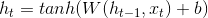
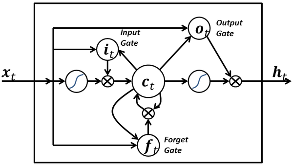
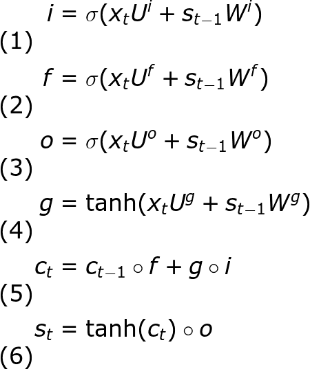
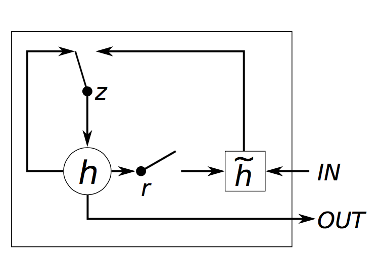
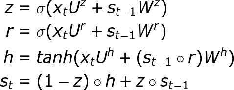

# RNN

사람은 대화하거나 글을 읽을 때 이전의 맥락을 이해하면서 현재의 단어를 이해 합니다. 

그래서 우리는 다른 사람들과 대화할 때 장단 모음의 세밀한 구분을 하지 않아도 하늘에서 내리는 눈과 얼굴의 눈 중 어떤 것을 말하는 것인지 쉽게 알수 있습니다. 보통의 신경망 알고리즘으로 위와 같은 데이터의 맥락을 학습 시킬수가 없습니다. 그래서 이런 단점을 해결하고자 **순환신경망** 알고리즘이 개발 되었습니다. 

순환 신경망에서 순환한다는 의미는 다음 그림에서 볼수 있듯이 신경망의 뉴런에서 나온 정보가 다시 재사용 되도록 순환되기 때문입니다.

그림에서 볼 수 있듯이 어떤 시간(t)의 뉴런에는 그 이전 시간(t-1)에 생성된 뉴런의 상태가 입력되어 새로운 상태가 만들어지고, 

그 데이터는 다시 그 이후시간 (t+1)에 입력 되는 구조입니다. 

순환 신경망에서는 종종 이런 뉴런을 메모리셀 혹은 그냥 셀이라고 부릅니다. 

은닉 상태 : 셀에서 만들어지는 상태 데이터 

은닉 상태 계산 : 현재 입력 값 * 가중치 (W) + 편향값 (b)

이렇게 계산된 은닉 상태는 상위 계층에서 전달되고 또 그다음 은닉 상태 계산을 위해 재 사용됩니다. 

셀에서 사용하는 이전의 은닉 상태는 과거 문맥에 관한 정보를 가지고 있기 때문에 현재 나타날 데이터를 예측하는데 도움을 줄 수 있습니다. 

## LSTM

기본적인 순환신경망은 비교적 짧은 거리에 있는 문맥의 정보를 실어 나르므로 멀리 떨어진 데이터간의 연관 정보는 파악하기 어렵습니다. 

이런 단점을 개선하기 위해서 LSTM(Long Short Term Memory) 순환 신경망 알고리즘이 등장 하였습니다. 

LSTM은 은닉 상태와 셀 상태 두가지를 계산합니다. 

은닉상태(h)는 상위 계층의 입력값으로 전달 되고 다음번 계산을 위해서도 전달되지만 셀 상태(c)는 상위 계층으로는 전달되지 않습니다. 

- i, f, o 는 각각 입력, 까먹음, 출력 게이트라고 부릅니다. 각 게이트의 수식은 동일한 형태를 띄고 있고, 파라미터 행렬만 다른 것을 확인할 수 있습니다. 이들이 게이트라고 부르는 이유는, sigmoid 함수가 이 벡터들의 값을 0에서 1 사이로 제한시키고 이를 다른 벡터와 elementwise 곱을 취한다면 그 다른 벡터값의 얼마만큼을 통과시킬지를 정해주는 것과 같기 때문입니다. 입력 게이트는 새 hidden state 값을 계산하는데 있어서 입력 벡터값을 얼만큼 사용할 지를 정해줍니다. 까먹음 게이트는 이전 state 값을 얼만큼 기억하고 있을지를 정해주고, 출력 게이트는 현재의 내부 state 값의 얼만큼을 LSTM 모듈의 바깥쪽에서 (더 깊은 레이어나 이후 시간 스텝에서) 볼 수 있을지를 정해줍니다. 모든 게이트들은 dsds로 hidden state와 같은 차원을 갖게 됩니다.
- g는 현재 입력과 이전 hidden state의 값을 기반으로 계산된 현재 hidden state 값의 "후보"라고 할 수 있습니다. RNN 기본형 모델에서 본 것과 동일한 수식으로 계산되는데, 파라미터 행렬의 이름만 U와 W가 UgUg와 WgWg로 바뀌었습니다. 그러나 이전처럼 g를 바로 새 hidden state로 정하는 대신, 여기서는 입력 게이트를 사용하여 일부만 사용합니다.
- ctct는 LSTM 유닛(모듈)의 내부 메모리입니다. 이것은 이전에 저장된 메모리인 ct−1ct−1과 까먹음 게이트의 곱, 그리고 새로 계산된 hidden state g와 입력 게이트의 곱을 합친 형태로 계산됩니다. 따라서, 간단히 말하면 이전 메모리와 현재의 새 입력을 어떻게 합칠까에 대한 부분입니다. 이전의 메모리를 전부 무시하도록 (까먹음 게이트 값이 전부 0) 정하거나 새로운 입력값을 통째로 무시하도록 (입력 게이트 값이 전부 0) 할 수도 있지만, 보통은 이 양 극단보다는 중간의 좋은 지점을 찾도록 합니다.
- 메모리값 ctct가 주어지면, 메모리와 출력 게이트의 곱으로 최종적으로 출력 hidden state stst가 계산됩니다. 모든 내부 메모리 값이 네트워크의 다른 유닛들에서 활용할 필요는 없을 수도 있기 때문에 출력 게이트를 통과시키는 것입니다.

# GRU

GRU는 리셋 게이트 r과 업데이트 게이트 z로, 총 두 가지 게이트가 있습니다. 게이트 이름에서 알 수 있듯이, 리셋 게이트는 새로운 입력을 이전 메모리와 어떻게 합칠지를 정해주고, 업데이트 게이트는 이전 메모리를 얼만큼 기억할지를 정해줍니다. 리셋 게이트 값을 전부 1로 정해주고 업데이트 게이트를 전부 0으로 정한다면, 기본 RNN 구조가 될 것입니다. 게이팅 메커니즘을 통해 긴 시퀀스를 잘 기억하도록 해준다는 점에서는 LSTM과 기본 아이디어가 같지만, 몇 가지 차이점이 있습니다.

- GRU는 게이트가 2개이고, LSTM은 3개입니다.
- GRU는 내부 메모리 값 ( ctct )이 외부에서 보게되는 hidden state 값과 다르지 않습니다. LSTM에 있는 출력 게이트가 없기 때문입니다.
- 입력 게이트와 까먹음 게이트가 업데이트 게이트 z로 합쳐졌고, 리셋 게이트 r은 이전 hidden state 값에 바로 적용됩니다. 따라서, LSTM의 까먹음 게이트의 역할이 r과 z 둘 다에 나눠졌다고 생각할 수 있습니다.
- 출력값을 계산할 때 추가적인 비선형 함수를 적용하지 않습니다.

[MNIST RNN Example](https://github.com/sjchoi86/tensorflow-101/blob/master/notebooks/rnn_mnist_simple.ipynb)

[word2vec](https://tensorflowkorea.gitbooks.io/tensorflow-kr/content/g3doc/tutorials/word2vec/)

[Char sample](https://github.com/sjchoi86/tensorflow-101/blob/master/notebooks/char_rnn_sample_tutorial.ipynb)

[Char rnn train](https://github.com/sjchoi86/tensorflow-101/blob/master/notebooks/char_rnn_train_tutorial.ipynb)

[Deep QA](https://github.com/Conchylicultor/DeepQA)

